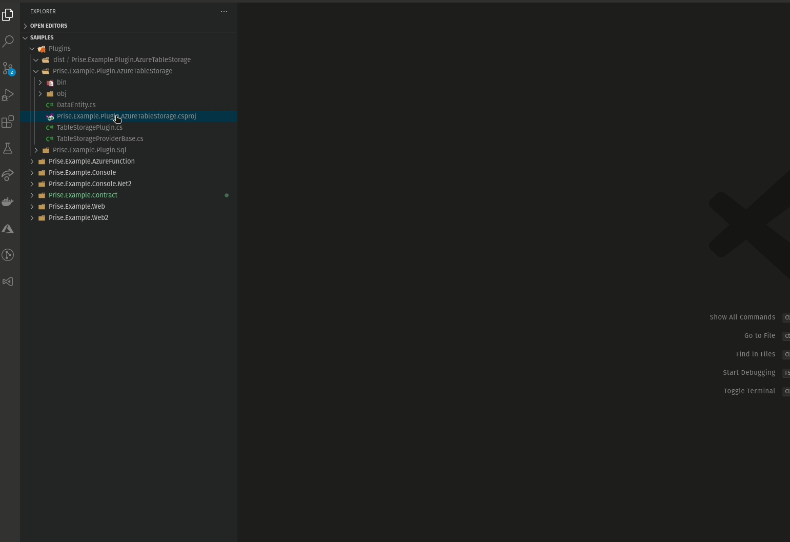
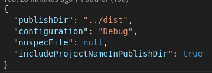
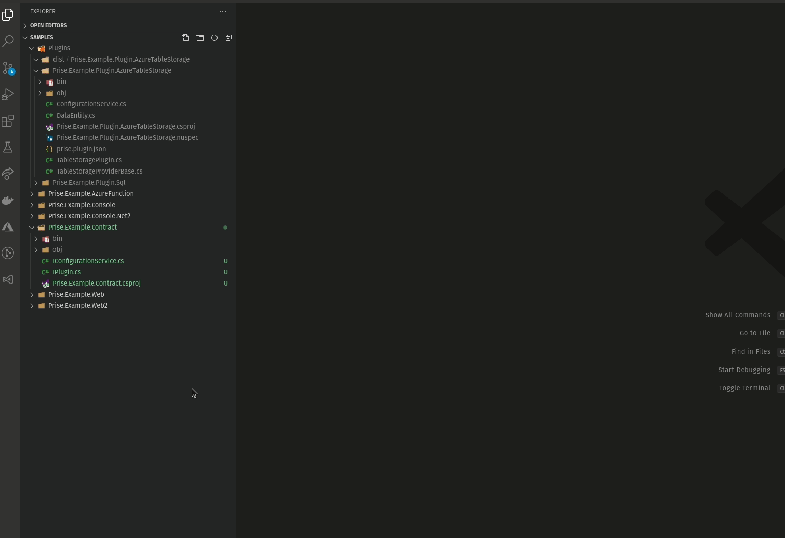
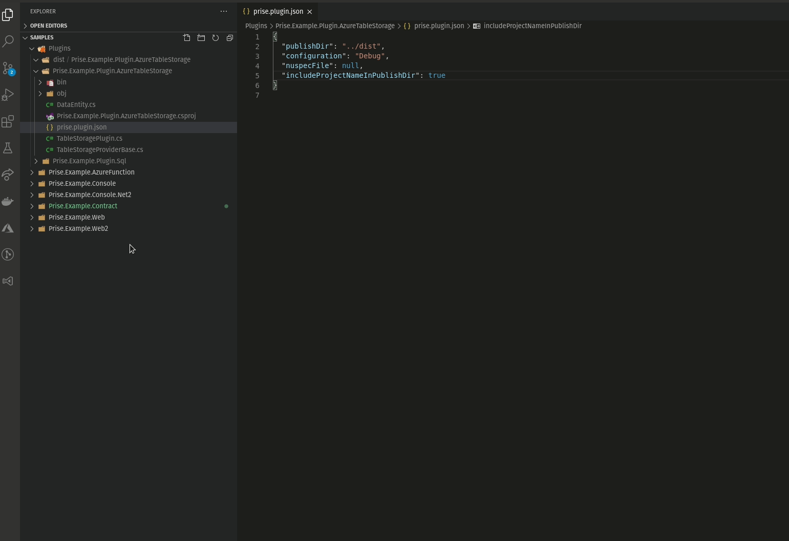
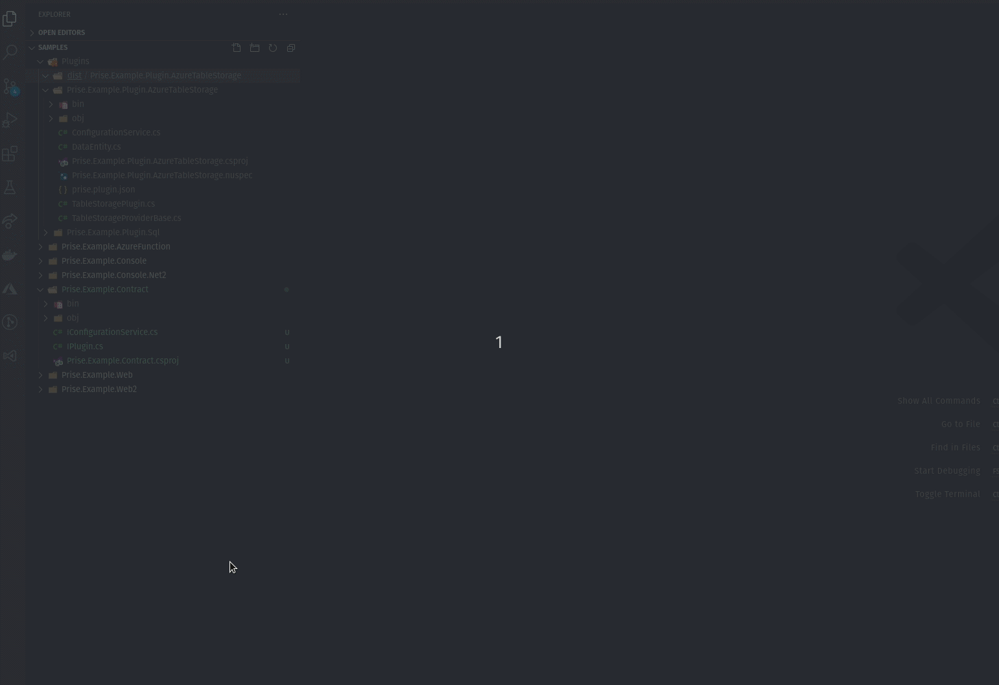

# Prise Plublish Plugin Extension

This extension lets you publish `Prise plugins` with ease from within VS Code!
After installing, any `csproj` file will be able to publish a compatible Prise plugin.

## First, create the prise.plugin.json config file.

Right-click on a `csproj` file and select `Create Prise Plugin File`

This will create the following file:

Properties of the plugin json file:
- `publishDir`: a relative or absolute system path to publish the plugin to
- `configuration`: Debug or Release
- `nuspecFile`: optional, path to the `.nuspec` to use in case of packaging a plugin nuget package
- `includeProjectNameInPublishDir`: default `false`. When `true`, adds the name of the `csproj` to the publishDir when publishing

## Publishing a Prise plugin to a dist folder
Make sure the `../dist` folder exists (relative to your `csproj` path).

Right-click on a `csproj` file and select `Publish Prise Plugin`

This publish process will respect the configuration from the `prise.plugin.json` file

## Publishing a Prise nuget plugin to a dist folder
Make sure the `../dist` folder exists (relative to your `csproj` path).

### Create the nuspec file
Right-click on a `csproj` file and select `Crate Prise NuSpec File`

You won't generally need to change anything to this file. Unless you change your `configuration` from `Debug` to `Release`.

### Publishing the Prise Plugin as NuGet package
Right-click on a `csproj` file and select `Publish Prise Plugin as NuGet package`

This .nupkg package is a `self-contained package`, it is slightly larger than a normal package, because it will contain all the required assemblies from the Plugin.
